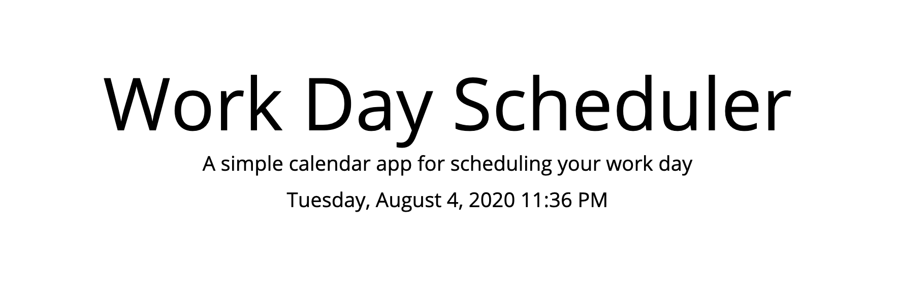
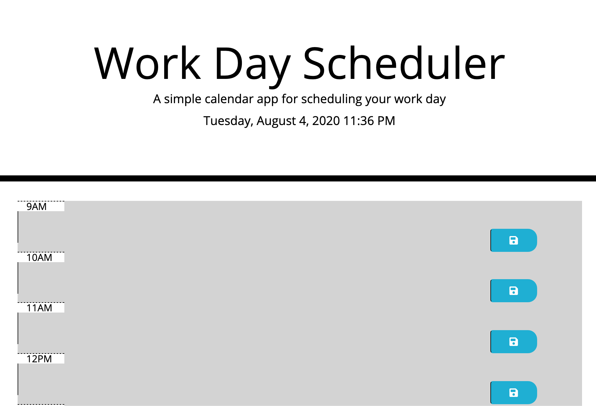
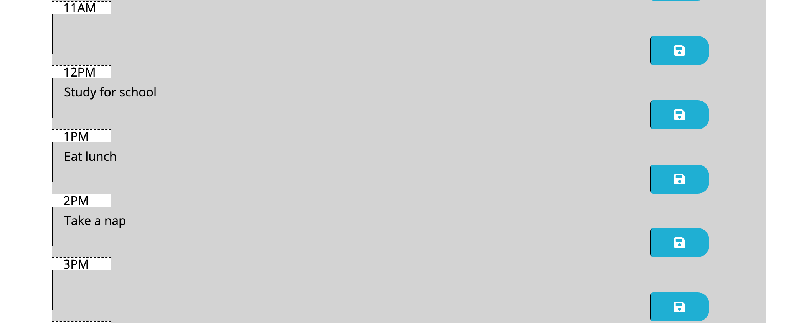

## Work Day Scheduler

I created a Work-Day Scheduler using the Moment.JS library.

When the user opens the planner, the current day is displayed at the top of the calendar. The user is presented with timeblocks for standard business hours and each timeblock is color coded to indicate whether it is in the past, present, or future. When the user clicks into a timeblock, an event can be entered. When the user clicks on the save button for that timeblock, the text for that event is saved in local storage. When the user refreshes the page, the saved events are still displayed on the page.

## Resources:
[Moment.js] https://momentjs.com/
[Bootstrap] https://getbootstrap.com/
[jQuery] https://jquery.com/

## Screenshots:

